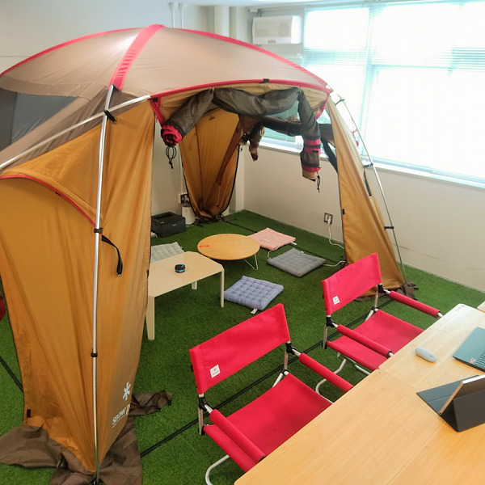

# 畑研究室のホームページ

[信州大学工学部 畑研究室](https://www.shinshu-u.ac.jp/faculty/engineering/eict/introduction/teacher/hata-hideaki.php)の公式Webサイトです。

## 研究

- [Denoの外部モジュールについての実証分析](./deno_research.md)

## 研究室の様子

現在6人の学生が活動しています！

## リンク

- [GitHub](https://github.com/piderlab/)
- [「信州大産」電力でＥＶシェア構想　乗りたい人のオークション形式で実験へ](https://www.shinmai.co.jp/news/article/CNTS2022010900118)

 
 
